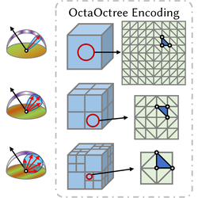

# OctaOctree Neural Radiosity

Official implementation of **OctaOctree**, a spatial-angular neural radiosity cache for real-time glossy global illumination in static scenes.

> Jierui Ren, Haojie Jin, Bo Pang, Meng Gai, Fei Zhu, Yisong Chen, Sheng Li<br>
> *OctaOctree Neural Radiosity for Real-time Glossy Material Rendering in Static Scenes*<br>
> SIGGRAPH Asia 2026 Conference Papers<br>
> [[arXiv]](https://arxiv.org/abs/2606.08469) &nbsp;|&nbsp; [[PDF]](https://arxiv.org/pdf/2606.08469) &nbsp;|&nbsp; [[DOI]](https://doi.org/10.1145/3829340.3842363)



Positional neural radiosity caches struggle with high-frequency, view-dependent radiance on glossy surfaces. OctaOctree encodes outgoing radiance with an **adaptive 3D octree** whose nodes each store an **octahedral directional map**. Fine spatial levels capture local illumination and visibility; coarser levels keep richer angular resolution so glossy structure can be shared across nearby points after parallax-aware remapping. A compact parallax estimator and decoder then predict outgoing radiance with a **single query at the primary hit**.

This repository provides training, interactive viewing, and offline rendering on top of a customized [Mitsuba 3](https://mitsuba-renderer.org/) (v3.5.2) backend.

## Method

- **OctaOctree encoding.** Sparse octree cells in 3D, each with a multi-resolution octahedral map; spatial and angular resolution are allocated in complementary directions across 8 hierarchy levels.
- **Parallax-aware lookup.** A tiny Instant-NGP-style network predicts a disparity-like correction that shifts the octahedral query direction before barycentric interpolation.
- **Primary-hit inference.** Rendering is G-buffer extraction plus one cache query and one decoder evaluation per visible shading point; no extra glossy cone rays at test time.

Default settings match the paper: 8 OctaOctree levels (spatial 2^2–2^9, complementary octahedral maps), 4 features per entry, 20,000 training steps. On an RTX 3090, training takes about 1 hour per scene and inference is about 10–20 ms.

## Installation

### Python environment

```bash
conda create -n mi3 python=3.9
conda activate mi3
pip install -r requirements.txt
pip install git+https://github.com/NVlabs/tiny-cuda-nn/#subdirectory=bindings/torch
pip install ocnn
```

A CUDA GPU is required (`cuda_rgb` Mitsuba variant). OctaOctree lookup uses a custom CUDA extension compiled on first use via `torch.utils.cpp_extension`. Octree construction uses [ocnn-pytorch](https://github.com/octree-nn/ocnn-pytorch).

### Mitsuba 3.5.2

Build our customized Mitsuba 3.5.2 and place it next to this repository:

```text
../official-submodules/mitsuba3-old
```

1. Clone [mitsuba3-old](https://github.com/Jerry18231174/mitsuba3-old) into `../official-submodules/`.
2. Compile following the [Mitsuba 3.5.2 compiling guide](https://mitsuba.readthedocs.io/en/v3.5.2/src/developer_guide/compiling.html).
3. Before training or rendering, source the Mitsuba environment:

```bash
source scripts/active_mitsuba.sh
```

## Usage

Configs live in `configs/`. The default `octaoctree` config matches the paper architecture. `octaoctree-hires` raises octahedral-map resolution for near-specular scenes (see the angular-resolution ablation in the paper).

Paper scenes: `bathroom`, `cornell-box`, `kitchen`, `living-room`, `veach-ajar`. `bath-hires` is an additional high-resolution bathroom variant.

### Train a scene

```bash
source scripts/active_mitsuba.sh
python train.py -c octaoctree -s veach-ajar
```

Training and rendering are single-GPU only. If the machine has more than one GPU, pin a single device before running:

```bash
export CUDA_VISIBLE_DEVICES=0
```

Checkpoints are written to `out/<scene>/checkpoints/OctreeNeLP/`. TensorBoard logs go to `out/<scene>/tb_logs/`.

Each batch starts with 65,536 LHS samples and M = 32 RHS Monte Carlo directions (`configs/octaoctree.json`). Training progressively halves the LHS count and doubles M every quarter of the schedule.

If large regions of the scene are occluded from the default camera, collect extra views so unshaded surfaces are sampled:

1. `python render.py -c octaoctree -s <scene>`
2. Move to an unoccluded pose and tick **Save camera config**.
3. Copy the saved `.npz` files into `scenes/<scene>/camera_poses/`.

If `camera_poses` is missing, training falls back to uniform surface sampling.

### Interactive rendering

```bash
source scripts/active_mitsuba.sh
python render.py -c octaoctree -s veach-ajar
```

In the viewer, set the integrator to **LHS** (network evaluation at the primary hit, as in the paper). Path and RHS modes are available for comparison.

### Offline image

```bash
python scripts/render_image.py -c octaoctree -s veach-ajar -r LHS -o octaoctree_lhs
```

The image is written to `out/<name>.exr`. Use `-r PT` for a path-traced reference.

## Citation

If you use this code, please cite:

```bibtex
@inproceedings{ren2026octaoctree,
  author    = {Ren, Jierui and Jin, Haojie and Pang, Bo and Gai, Meng and Zhu, Fei and Chen, Yisong and Li, Sheng},
  title     = {OctaOctree Neural Radiosity for Real-time Glossy Material Rendering in Static Scenes},
  booktitle = {SIGGRAPH Asia 2026 Conference Papers},
  year      = {2026},
  doi       = {10.1145/3829340.3842363},
  url       = {https://doi.org/10.1145/3829340.3842363}
}
```

Preprint:

```bibtex
@article{ren2026octaoctree_arxiv,
  title   = {OctaOctree Neural Radiosity for Real-time Glossy Material Rendering},
  author  = {Ren, Jierui and Jin, Haojie and Pang, Bo and Gai, Meng and Zhu, Fei and Chen, Yisong and Li, Sheng},
  journal = {arXiv preprint arXiv:2606.08469},
  year    = {2026},
  url     = {https://arxiv.org/abs/2606.08469}
}
```

## License

This project is released under the [MIT License](LICENSE). Test scenes under `scenes/` retain their original licenses (typically CC0 from the Bitterli resources).

## Acknowledgements

This implementation builds on [Mitsuba 3](https://mitsuba-renderer.org/), [tiny-cuda-nn](https://github.com/NVlabs/tiny-cuda-nn), [ocnn-pytorch](https://github.com/octree-nn/ocnn-pytorch), and the neural radiosity formulation of Hadadan et al. Test scenes are adapted from the [Bitterli rendering resources](https://benedikt-bitterli.me/resources/).
